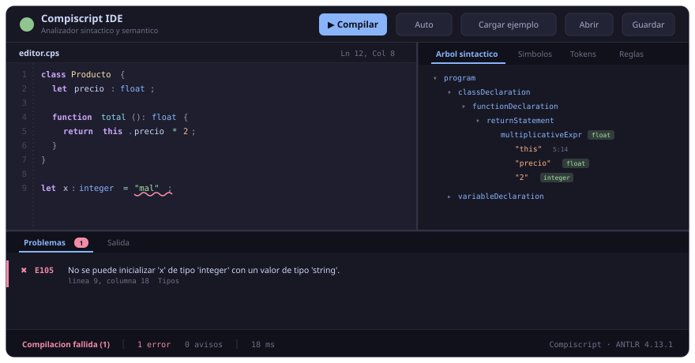

# 🧪 Compiscript — Analizador Sintáctico y Semántico

Front-end completo de un compilador para **Compiscript**, un subconjunto de
TypeScript. Cubre las fases de análisis **léxico**, **sintáctico** y
**semántico**, construye una **tabla de símbolos** con manejo de entornos e
incluye un **IDE web** para escribir y compilar código.

> Fase 1 del proyecto de Compiladores. Análisis léxico y sintáctico con
> **ANTLR 4.13.1**; análisis semántico implementado sobre un *Visitor* en
> Python.

---

## 🚀 Inicio rápido

### Opción A — Local (recomendada para desarrollar)

Sólo hace falta **Python 3.10+**. El lexer y el parser generados por ANTLR ya
vienen versionados, así que no se necesita Java para ejecutar el proyecto.

```bash
pip install -r requirements.txt

# Analizar un archivo
python -m compiscript tests/programs/valid/07_programa_completo.cps

# Ver la tabla de símbolos y el árbol sintáctico
python -m compiscript mi_programa.cps --symbols --tree

# Levantar el IDE  ->  http://127.0.0.1:5000
python ide/app.py

# Batería de tests
python -m pytest tests/ -v
```

> Si `python -m compiscript` no encuentra el paquete, exporta la ruta:
> `PYTHONPATH=src` (Linux/macOS) o `$env:PYTHONPATH="src"` (PowerShell).
> Alternativamente `pip install -e .` lo instala como comando `compiscript`.

### Opción B — Docker (recomendada para calificar)

No requiere instalar nada más que Docker.

```bash
docker build -t compiscript .

docker compose up ide                    # IDE en http://localhost:5000
docker compose run --rm test             # batería de tests
docker run --rm -v "$(pwd):/trabajo" compiscript cli /trabajo/programa.cps
```

---

## 🖥️ El IDE



`python ide/app.py` levanta un editor en el navegador con:

| Zona | Contenido |
| --- | --- |
| **Editor** | Monaco (el de VS Code) con resaltado de sintaxis propio de Compiscript, autocompletado y snippets |
| **Problemas** | Errores y advertencias con código, categoría y ubicación; al hacer clic salta a la línea |
| **Árbol sintáctico** | Vista jerárquica plegable del parse tree, con el **tipo inferido** de cada expresión |
| **Tabla de símbolos** | Ámbitos anidados con tipo, categoría, almacenamiento, offset, tamaño y capturas de closures |
| **Tokens** | Volcado del flujo léxico |
| **Reglas** | Catálogo consultable de las 53 reglas semánticas implementadas |

Los errores se subrayan en el editor en tiempo real (análisis automático con
retardo de 450 ms) o al pulsar **Compilar** / `Ctrl+Enter`.

---

## 📂 Estructura del repositorio

```
Analisis-Semantico/
├── compiscript/                  Material original del curso (sin modificar)
│   ├── program/Compiscript.g4    gramática de referencia
│   └── antlr-4.13.1-complete.jar
├── grammar/
│   └── Compiscript.g4            gramática del proyecto (única fuente de verdad)
├── src/compiscript/
│   ├── generated/                lexer/parser/visitor generados por ANTLR
│   ├── diagnostics.py            catálogo de errores y reporter
│   ├── types.py                  sistema de tipos y reglas de compatibilidad
│   ├── symbols.py                símbolos (variable, función, clase, atributo)
│   ├── scope.py                  tabla de símbolos y árbol de ámbitos
│   ├── collector.py              PASADA 1 — recolección de declaraciones
│   ├── checker.py                PASADA 2 — comprobación semántica (Visitor)
│   ├── syntax.py                 puente con ANTLR y errores de sintaxis
│   ├── tree_export.py            árbol → JSON / DOT / texto
│   ├── analysis.py               orquestador (API pública)
│   └── cli.py                    línea de comandos
├── ide/                          IDE web (Flask + Monaco)
├── tests/                        batería de 364 tests
│   └── programs/{valid,invalid}  programas .cps completos
├── docs/                         documentación de arquitectura y ejecución
└── tools/generate_parser.py      regeneración del parser desde la gramática
```

---

## 📖 Documentación

| Documento | Contenido |
| --- | --- |
| [`docs/ARQUITECTURA.md`](docs/ARQUITECTURA.md) | Diseño del compilador, las dos pasadas, sistema de tipos, tabla de símbolos, decisiones de diseño |
| [`docs/EJECUCION.md`](docs/EJECUCION.md) | Cómo instalar, ejecutar, regenerar el parser y usar el IDE |
| [`docs/REGLAS_SEMANTICAS.md`](docs/REGLAS_SEMANTICAS.md) | Las 53 reglas con su código, ejemplo del error y test que la cubre |

---

## ✅ Cobertura de los requerimientos

| # | Requerimiento del enunciado | Dónde está |
| --- | --- | --- |
| 1 | Analizador sintáctico con ANTLR | `grammar/Compiscript.g4`, `src/compiscript/generated/` |
| 2 | Reglas semánticas + árbol sintáctico visual | `checker.py`, `tree_export.py`, pestaña *Árbol* del IDE |
| 2.1 | Sistema de tipos | `types.py` + reglas `E1xx` |
| 2.2 | Manejo de ámbito | `scope.py` + reglas `E2xx` |
| 2.3 | Funciones, recursión y closures | `collector.py`, `checker.py` + reglas `E3xx` |
| 2.4 | Control de flujo | `checker.py` + reglas `E4xx` |
| 2.5 | Clases y objetos | `collector.py`, `checker.py` + reglas `E5xx` |
| 2.6 | Listas y estructuras | `checker.py` + reglas `E6xx` |
| 2.7 | Generales (código muerto, duplicados…) | `checker.py` + reglas `E7xx` / `W9xx` |
| 3 | Recorrido con Visitor de ANTLR | `checker.py` (`CompiscriptVisitor`) |
| 4 | Batería de tests de casos exitosos y fallidos | `tests/` — 364 tests |
| 5 | Tabla de símbolos con entornos | `symbols.py`, `scope.py` |
| 6 | IDE | `ide/` |
| 7 | Documentación | `docs/` |

---

## 🔧 Extensión a la gramática

La gramática entregada por el curso se conservó **íntegra salvo un cambio**:
se añadió el tipo primitivo `float` y su literal.

```antlr
baseType: 'boolean' | 'integer' | 'float' | 'string' | Identifier;   // + float

Literal : FloatLiteral | IntegerLiteral | StringLiteral;             // + FloatLiteral
FloatLiteral: [0-9]+ '.' [0-9]+;
```

**Motivo:** `README_SEMANTIC_ANALYSIS.md` exige verificar que las operaciones
aritméticas operen sobre `integer` **o `float`**, pero la gramática original no
contemplaba `float`. El cambio es retrocompatible: todo programa válido con la
gramática original lo sigue siendo con ésta (verificado con
`compiscript/program/program.cps`, que analiza sin errores).

El detalle de ésta y del resto de decisiones de diseño está en
[`docs/ARQUITECTURA.md`](docs/ARQUITECTURA.md).

---

## 🧪 Estado de la batería de tests

```
364 passed
```

```bash
python -m pytest tests/ -v                 # todo
python -m pytest tests/ -m tipos           # sólo el sistema de tipos
python -m pytest tests/ -m clases          # sólo clases y objetos
```

Marcas disponibles: `tipos`, `ambito`, `funciones`, `flujo`, `clases`,
`listas`, `generales`, `tabla`.
