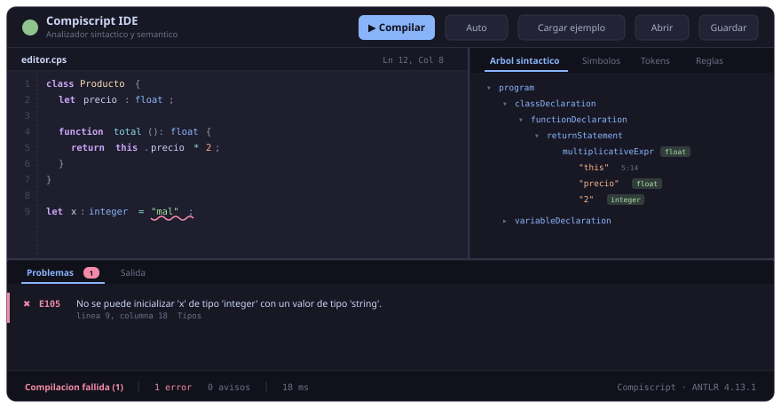

# 🧪 Compiscript — Compilador

Compilador para **Compiscript**, un subconjunto de TypeScript. Cubre el
análisis **léxico**, **sintáctico** y **semántico**, construye una **tabla de
símbolos** con manejo de entornos y registros de activación, genera **código
intermedio de tres direcciones (TAC)** y trae un **IDE web** para escribir,
compilar y **ejecutar** código.

```
programa.cps  ──►  ANTLR  ──►  Analisis semantico  ──►  TAC  ──►  [MIPS]
                  lexer+parser    tipos, ambitos       codigo de     fase
                                  tabla de simbolos    3 direcciones futura
```

> Fases 1 y 2 del proyecto de Compiladores. Análisis léxico y sintáctico con
> **ANTLR 4.13.1**; análisis semántico y generación de código intermedio
> implementados sobre *Visitors* en Python.

---

## 🚀 Inicio rápido

### Opción A — Local (recomendada para desarrollar)

Sólo hace falta **Python 3.10+**. El lexer y el parser generados por ANTLR ya
vienen versionados, así que no se necesita Java para ejecutar el proyecto.

```bash
pip install -r requirements.txt

# Analizar un archivo
python -m compiscript tests/programs/valid/07_programa_completo.cps

# Ver la tabla de símbolos y el árbol sintáctico (compacto)
python -m compiscript mi_programa.cps --symbols --tree

# El árbol completo, con todos los nodos de la gramática
python -m compiscript mi_programa.cps --tree-completo

# Ver el código intermedio generado
python -m compiscript mi_programa.cps --tac

# Ejecutarlo en la máquina virtual del TAC
python -m compiscript mi_programa.cps --run

# Levantar el IDE  ->  http://127.0.0.1:5000
python ide/app.py

# Batería de tests
python -m pytest tests/ -v
```

> Si `python -m compiscript` no encuentra el paquete, exporta la ruta:
> `PYTHONPATH=src` (Linux/macOS) o `$env:PYTHONPATH="src"` (PowerShell).
> Alternativamente `pip install -e .` lo instala como comando `compiscript`.

### Opción B — Docker (recomendada para calificar)

No requiere instalar nada más que Docker.

```bash
docker build -t compiscript .

docker compose up ide                    # IDE en http://localhost:5000
docker compose run --rm test             # batería de tests
docker run --rm -v "$(pwd):/trabajo" compiscript cli /trabajo/programa.cps
```

---

## 🖥️ El IDE



`python ide/app.py` levanta un editor en el navegador con:

| Zona | Contenido |
| --- | --- |
| **Editor** | Monaco (el de VS Code) con resaltado de sintaxis propio de Compiscript, autocompletado y snippets |
| **Problemas** | Errores y advertencias con código, categoría y ubicación; al hacer clic salta a la línea |
| **Árbol sintáctico** | Dos vistas — **Indentado** (jerárquico plegable) y **Gráfico** (nodos y aristas en SVG con zoom, desplazamiento y salto a la línea al hacer clic) — y dos niveles de detalle: **Compacto** (por defecto; colapsa la cascada de precedencia de ANTLR, ~55 % menos nodos) y **Completo**. Cada expresión muestra su **tipo inferido** |
| **Tabla de símbolos** | Ámbitos anidados con tipo, categoría, almacenamiento, offset, tamaño y capturas de closures |
| **Código intermedio** | El TAC generado, con numeración opcional y filtro por rutina |
| **Ejecución** | La salida real del programa, ejecutado sobre el TAC |
| **Tokens** | Volcado del flujo léxico |
| **Reglas** | Catálogo consultable de las 53 reglas semánticas implementadas |

Los errores se subrayan en el editor en tiempo real (análisis automático con
retardo de 450 ms) o al pulsar **Compilar** / `Ctrl+Enter`. El botón
**Ejecutar** (`F6`) compila a código intermedio y lo corre en la máquina
virtual, mostrando lo que el programa imprime.

---

## 📂 Estructura del repositorio

```
Analisis-Semantico/
├── compiscript/                  Material original del curso (sin modificar)
│   ├── program/Compiscript.g4    gramática de referencia
│   └── antlr-4.13.1-complete.jar
├── grammar/
│   └── Compiscript.g4            gramática del proyecto (única fuente de verdad)
├── src/compiscript/
│   ├── generated/                lexer/parser/visitor generados por ANTLR
│   ├── diagnostics.py            catálogo de errores y reporter
│   ├── types.py                  sistema de tipos y reglas de compatibilidad
│   ├── symbols.py                símbolos (variable, función, clase, atributo)
│   ├── scope.py                  tabla de símbolos y árbol de ámbitos
│   ├── collector.py              PASADA 1 — recolección de declaraciones
│   ├── checker.py                PASADA 2 — comprobación semántica (Visitor)
│   ├── syntax.py                 puente con ANTLR y errores de sintaxis
│   ├── tree_export.py            árbol → JSON / DOT / texto
│   ├── tac/                      FASE 2 — código intermedio
│   │   ├── quadruple.py          cuádruplas, operandos, programa TAC
│   │   ├── temporaries.py        pool de temporales con reciclaje
│   │   ├── runtime.py            rutinas de apoyo (__print, __concat, …)
│   │   ├── generator.py          PASADA 3 — Compiscript → TAC
│   │   ├── validator.py          invariantes del código generado
│   │   └── vm.py                 máquina virtual que ejecuta el TAC
│   ├── analysis.py               orquestador (API pública)
│   └── cli.py                    línea de comandos
├── ide/                          IDE web (Flask + Monaco)
├── tests/                        batería de 571 tests
│   └── programs/{valid,invalid}  programas .cps completos
├── docs/                         documentación de arquitectura y ejecución
└── tools/generate_parser.py      regeneración del parser desde la gramática
```

---

## 📖 Documentación

| Documento | Contenido |
| --- | --- |
| [`docs/ARQUITECTURA.md`](docs/ARQUITECTURA.md) | Diseño del compilador, las dos pasadas, sistema de tipos, tabla de símbolos, decisiones de diseño |
| [`docs/EJECUCION.md`](docs/EJECUCION.md) | Cómo instalar, ejecutar, regenerar el parser y usar el IDE |
| [`docs/REGLAS_SEMANTICAS.md`](docs/REGLAS_SEMANTICAS.md) | Las 53 reglas con su código, ejemplo del error y test que la cubre |
| [`docs/CODIGO_INTERMEDIO.md`](docs/CODIGO_INTERMEDIO.md) | **Diseño del lenguaje intermedio**: repertorio de instrucciones, modelo de memoria, registros de activación, esquemas de traducción y supuestos |
| [`docs/GUION_DEMO.md`](docs/GUION_DEMO.md) | Guion de la demostración, con el mapa paso → requerimiento de la rúbrica |

---

## ✅ Cobertura de los requerimientos

| # | Requerimiento del enunciado | Dónde está |
| --- | --- | --- |
| 1 | Analizador sintáctico con ANTLR | `grammar/Compiscript.g4`, `src/compiscript/generated/` |
| 2 | Reglas semánticas + árbol sintáctico visual | `checker.py`, `tree_export.py`, pestaña *Árbol* del IDE |
| 2.1 | Sistema de tipos | `types.py` + reglas `E1xx` |
| 2.2 | Manejo de ámbito | `scope.py` + reglas `E2xx` |
| 2.3 | Funciones, recursión y closures | `collector.py`, `checker.py` + reglas `E3xx` |
| 2.4 | Control de flujo | `checker.py` + reglas `E4xx` |
| 2.5 | Clases y objetos | `collector.py`, `checker.py` + reglas `E5xx` |
| 2.6 | Listas y estructuras | `checker.py` + reglas `E6xx` |
| 2.7 | Generales (código muerto, duplicados…) | `checker.py` + reglas `E7xx` / `W9xx` |
| 3 | Recorrido con Visitor de ANTLR | `checker.py` (`CompiscriptVisitor`) |
| 4 | Batería de tests de casos exitosos y fallidos | `tests/` — 571 tests |
| 5 | Tabla de símbolos con entornos | `symbols.py`, `scope.py` |
| 6 | IDE | `ide/` |
| 7 | Documentación | `docs/` |

### Fase 2 — Generación de código intermedio

| Requerimiento del enunciado | Dónde está |
| --- | --- |
| Acciones semánticas para generar código intermedio | `tac/generator.py` (pasada 3) |
| Sintaxis del CI a discreción del diseñador | [`docs/CODIGO_INTERMEDIO.md`](docs/CODIGO_INTERMEDIO.md) |
| Tabla de símbolos con direcciones y etiquetas | `symbols.py` — `storage`, `offset`, `size`, `label`, `vtable_slots` |
| **Algoritmo de asignación y reciclaje de temporales** | `tac/temporaries.py` — `TempPool` |
| Registros de activación | `symbols.py` — `ActivationRecord`; CLI `--frames` |
| Batería de tests (casos exitosos y fallidos) | `tests/test_tac_*.py` |
| IDE que compile el código del usuario | pestañas *Código intermedio* y *Ejecución* |
| Documentación de la arquitectura | [`docs/ARQUITECTURA.md`](docs/ARQUITECTURA.md) |
| **Documentación detallada del lenguaje intermedio** | [`docs/CODIGO_INTERMEDIO.md`](docs/CODIGO_INTERMEDIO.md) |

Extras que no pedía el enunciado pero respaldan la corrección de la traducción:

| Extra | Para qué |
| --- | --- |
| `tac/validator.py` | Comprueba 10 invariantes del código generado; aporta los *casos fallidos* de la batería |
| `tac/vm.py` | **Ejecuta** el TAC: los tests verifican que `factorial(5)` da `120`, no sólo que el código "se parezca" |

---

## 👥 Contribuciones por integrante

> Requerimiento 8 del enunciado: *«Se validan los commits y contribuciones de cada
> integrante, no se permite "compartir" commits en conjunto, debe notarse
> claramente qué porción de código implementó cada integrante.»*

Cada integrante trabajó sobre **módulos disjuntos** y firmó sus propios commits.
No hay ningún commit compartido ni coautoría: la tabla se puede verificar con

```bash
git log --format='%h %an <%ae> %s'
git shortlog -sne
```

| Integrante | Autor en git | Módulos implementados | Commits |
| --- | --- | --- | --- |
| **Humberto Alexander de la Cruz** | `hadelacruz <humbertoalexanderdelacruz@gmail.com>` | Estructura del proyecto y material del curso · `grammar/Compiscript.g4` (incl. la extensión `float`) y la generación del parser (`tools/generate_parser.py`, `src/compiscript/generated/`) · **sistema de tipos** (`types.py`) · **tabla de símbolos y ámbitos** (`symbols.py`, `scope.py`) | `6a3fc89`, `061e8b3`, `d4bb6c2`, `30301b1`, `50f7ecf` |
| **_(completar nombre)_ — `djuarez-2017510`** | `djuarez-2017510 <djuarez-2017510@kinal.edu.gt>` | **Catálogo de reglas y puente con ANTLR** (`diagnostics.py`, `syntax.py`) · **pasada 1: recolección de declaraciones / hoisting** (`collector.py`) · **pasada 2: visitor de análisis semántico** (`checker.py`) · orquestador y CLI (`analysis.py`, `cli.py`, `tree_export.py`) | `d27c7f2`, `8a544a4`, `22689c1`, `dde4839` |
| **Dilary Cruz** | `Dilary Cruz <cru231010@uvg.edu.gt>` | **Batería de tests** completa (10 suites + 14 programas `.cps` anotados) · **IDE web** (`ide/`: backend Flask, front-end Monaco, ejemplos) · **documentación** (`docs/`) y **Docker** | `cd3c322`, `66d4a4e`, `46b0081`, `c1cbe48` |

**Reparto por requerimiento del enunciado**

| Requerimiento | Responsable principal |
| --- | --- |
| 1 — Analizador sintáctico (ANTLR) | Humberto de la Cruz |
| 2.1 — Sistema de tipos | Humberto de la Cruz (`types.py`) + `djuarez-2017510` (`checker.py`) |
| 2.2 — Manejo de ámbito | Humberto de la Cruz (`scope.py`) + `djuarez-2017510` (`checker.py`) |
| 2.3 a 2.7 — Funciones, flujo, clases, listas, generales | `djuarez-2017510` |
| 3 — Recorrido con Visitor | `djuarez-2017510` |
| 4 — Batería de tests | Dilary Cruz |
| 5 — Tabla de símbolos | Humberto de la Cruz |
| 6 — IDE | Dilary Cruz |
| 7 — Documentación | Dilary Cruz |

---

## 🔧 Extensión a la gramática

La gramática entregada por el curso se conservó **íntegra salvo un cambio**:
se añadió el tipo primitivo `float` y su literal.

```antlr
baseType: 'boolean' | 'integer' | 'float' | 'string' | Identifier;   // + float

Literal : FloatLiteral | IntegerLiteral | StringLiteral;             // + FloatLiteral
FloatLiteral: [0-9]+ '.' [0-9]+;
```

**Motivo:** `README_SEMANTIC_ANALYSIS.md` exige verificar que las operaciones
aritméticas operen sobre `integer` **o `float`**, pero la gramática original no
contemplaba `float`. El cambio es retrocompatible: todo programa válido con la
gramática original lo sigue siendo con ésta (verificado con
`compiscript/program/program.cps`, que analiza sin errores).

El detalle de ésta y del resto de decisiones de diseño está en
[`docs/ARQUITECTURA.md`](docs/ARQUITECTURA.md).

---

## 🧪 Estado de la batería de tests

```
571 passed
```

```bash
python -m pytest tests/ -v                 # todo
python -m pytest tests/ -m tipos           # sólo el sistema de tipos
python -m pytest tests/ -m clases          # sólo clases y objetos
```

Marcas disponibles: `tipos`, `ambito`, `funciones`, `flujo`, `clases`,
`listas`, `generales`, `tabla`, `tac`, `vm`.

```bash
python -m pytest tests/ -m tac    # solo la fase de codigo intermedio
python -m pytest tests/ -m vm     # solo la ejecucion del TAC
```
